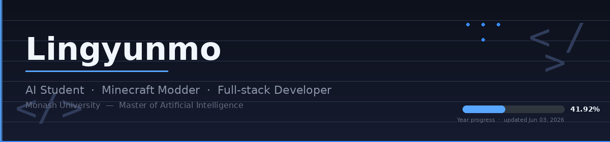

  

### Hi, I'm Lingyunmo 👋

I'm a Master of AI student at Monash, but my GitHub makes me look like a full-time Minecraft modder. Honestly, it's not that far off.

Most days I'm either writing Minecraft mods, shipping full-stack web apps, or coaxing Docker containers into staying alive. I self-host my own infrastructure — which means I'm both the developer and the person who gets paged when something breaks at 2 AM.

---

### 🧊 Minecraft Mods & Plugins

I build mods for both **Forge** and **Fabric**, plus server plugins. Also into modpacks and server configs — basically anything in Minecraft you can mess with.

 

  
  &nbsp;
  
  
  
  
   
  Ore processing, custom dimension. Built on Architectury — work in progress. ⚠️

 

  
  &nbsp;
  
  
  
  
   
  47 vanilla foods × 3 delivery modes = 4,500+ infused variants. Infusion Table workstation with hopper automation & redstone control.

 

  
  &nbsp;
  
  
  
  
   
  Custom brewing mechanics. My first mod — where it all started.

 

  
  &nbsp;
  
  
  
   
  A Paper server plugin bringing custom mobs to 1.16.5. Rewrite of the original EpicMobs.

---

### 🤖 AI & Other Projects

  
  &nbsp;
  
  
  
  
   
  Lets a local LLM reply to WeChat messages while I'm asleep. Pulls from my chat history so it sounds like me, not a bot. Urgent messages wake me up.

 

  
  &nbsp;
  
   
  AI-powered customer service processing system. Graduation design project.

 

  
  &nbsp;
  
  
   
  A dynamic web platform inspired by Baidu. Vue frontend + TypeScript backend API.

---

### 🎓 What I Study

AI & NLP at Monash. Currently deep in **Python** and **PyTorch** — language models, data mining, and the universal struggle of debugging a loss curve that won't go down.

---

### 🛠️ What I Actually Use

#### Languages

  
  
  
  
  

#### Frameworks & Libraries

  
  
  
  

#### Infrastructure

  
  
  
  
  

#### Build & CI

  
  

#### Minecraft Ecosystem

  
  
  
  

---

### 📈 GitHub Stats

  
  

 

  <picture>
    <source media="(prefers-color-scheme: dark)" srcset="https://raw.githubusercontent.com/lingyunmo/lingyunmo/output/github-contribution-grid-snake-dark.svg">
    <source media="(prefers-color-scheme: light)" srcset="https://raw.githubusercontent.com/lingyunmo/lingyunmo/output/github-contribution-grid-snake.svg">
    
  </picture>

